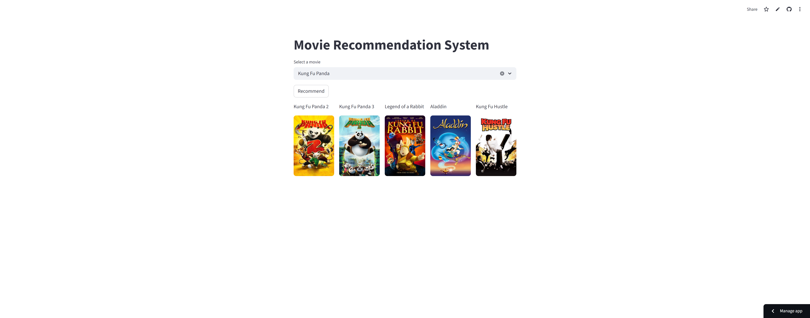

# Content-Based Movie Recommendation System

A movie recommendation system built using cosine similarity that suggests movies based on content similarity.

## Live Demo

https://content-based-movie-recommender-v1.streamlit.app/

## Features

* Content-based movie recommendation
* Cosine similarity algorithm
* Movie poster fetching using TMDB API
* Interactive Streamlit interface
* Fast recommendations

## Tech Stack

* Python
* Streamlit
* Pandas
* Scikit-learn
* Pickle

## Screenshots

### Main Interface


### Recommendation Results



## Project Structure

```text
content-based-movie-recommender/
│
├── app.py
├── movies.pkl
├── requirements.txt
├── README.md
├── .gitignore
└── screenshots/
    ├── home_page.png
    └── recommendations.png
```

## Installation

```bash
git clone <repo-link>
cd content-based-movie-recommender
pip install -r requirements.txt
streamlit run app.py
```
